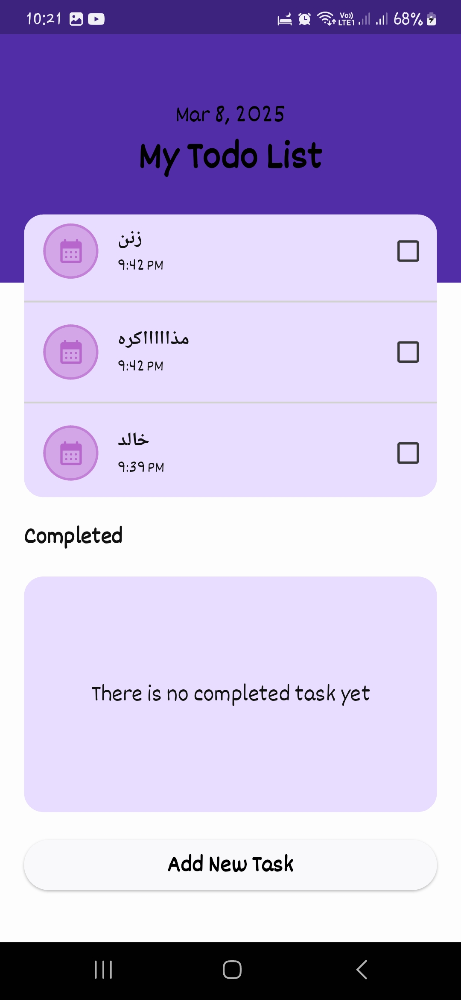

# To-Do List App

A feature-rich To-Do List application built with Flutter. This app allows users to add, categorize, and manage tasks with reminders, notifications, and a beautiful UI.

## Features
- Add, edit, and delete tasks with descriptions and categories.
- Receive notifications and alarms for task reminders.
- Dark mode support for a better user experience.
- Task statistics to track progress.
- Voice command support for task entry.
- SQLite database for local task storage.
- Scheduled tasks and repeat alarms.

## Dependencies

### Notifications & Alarms
- **android_alarm_manager_plus: ^4.0.7** - Used for scheduling alarms even when the app is closed.
- **awesome_notifications: ^0.10.1** - Provides rich notifications with custom sounds, buttons, and images.
- **flutter_local_notifications: ^18.0.1** - Enables local notifications with scheduling and background execution.

### UI & Theming
- **cupertino_icons: ^1.0.8** - Provides Cupertino-style icons for a native iOS look.
- **flex_color_scheme: ^8.1.1** - Simplifies theme customization with predefined color schemes.
- **google_fonts: ^6.2.1** - Allows using Google Fonts for a modern UI.

### Navigation & State Management
- **go_router: ^14.8.1** - A declarative routing package for smooth navigation.
- **provider: ^6.1.2** - A lightweight state management solution.
- **flutter_riverpod: ^2.6.1** - A robust state management package with better performance.

### Date & Time Handling
- **flutter_datetime_picker: ^1.5.1** - Provides a customizable date and time picker.
- **flutter_timezone: ^4.1.0** - Retrieves the device’s current timezone.
- **intl: ^0.20.2** - Handles date, time, and localization formatting.

### File & Storage
- **sqflite: ^2.4.2** - A local SQLite database for storing tasks.
- **path_provider: ^2.0.11** - Helps locate directories for file storage.
- **path: ^1.9.1** - Manages file system paths easily.

### Permissions & Settings
- **app_settings: ^5.2.0** - Opens system settings directly from the app.
- **permission_handler: ^11.4.0** - Requests and checks device permissions.

### Additional Utilities
- **equatable: ^2.0.7** - Simplifies value comparisons for objects.
- **font_awesome_flutter: ^10.8.0** - Provides a rich set of FontAwesome icons.
- **gap: ^3.0.1** - Adds spacing between widgets for better layout management.
- **timezone: ^0.10.0** - Handles time zone conversions.

## Installation
1. Clone the repository:
   ```sh
   git clone https://github.com/your-repo/todo-list-app.git
   cd todo-list-app
## Preview

Here are some preview images of the app:

| Image 1 | Image 2 | Image 3 | Image 4 | Image 5 |
|---------|---------|---------|---------|---------|
|  |  |  |  |  |
## Programmer

This project was developed by **Khaled Mostafa Esmael**. Here’s a little about me:

- **Name**: Khaled Mostafa Esmael
- **Role**: Full-Stack Developer / Mobile App Developer / etc.
- **Bio**: A passionate developer with  in [ skills, e.g., Flutter, Android, Python, etc.]. I love building innovative and user-friendly applications.
- **GitHub**: [My GitHub Profile](https://github.com/KhaledElKenawy00)


### Key Fields in the **About the Project** Section:
1. **Project Name**: Todo app .
2. **Version**: 1.000000
3. **Description**: 
  This is a Todo app created by me. I received permission to develop this project from a student named:  
  <span style="font-size: 20px; color: #FF5733;">**Karima A. Ismail**</span>.  
  The app is designed to help users manage their tasks efficiently and stay organized.